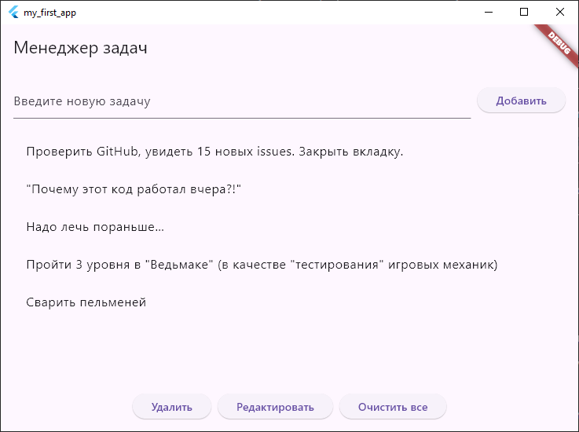

# Менеджер задач на Flutter

Простое приложение для управления задачами, написанное на Flutter.

## Функциональность

- Добавление новых задач
- Удаление выбранных задач
- Редактирование существующих задач
- Очистка всего списка задач
- Выбор задачи касанием
- Валидация ввода
- Подтверждение опасных действий

## Установка

1. Убедитесь, что у вас установлен Flutter SDK
2. Клонируйте репозиторий:
   ```bash
   git clone https://github.com/vi21g/52-lesson.git
   ```
3. Перейдите в директорию проекта:
   ```bash
   cd task-manager-flutter
   ```
4. Запустите приложение:
   ```bash
   flutter run
   ```

## Использование

1. Введите задачу в текстовое поле и нажмите "Добавить" или Enter
2. Для выбора задачи коснитесь её в списке
3. Используйте кнопки:
   - "Удалить" - удаляет выбранную задачу
   - "Редактировать" - открывает диалог редактирования выбранной задачи
   - "Очистить все" - удаляет все задачи (с подтверждением)

## Структура кода

- `main()` - точка входа в приложение
- `TaskManagerApp` - корневой виджет приложения
- `TaskManagerHomePage` - главный экран с StatefulWidget
  - Управление списком задач
  - Обработка добавления/удаления/редактирования
  - Диалоговые окна

## Зависимости

Только Flutter SDK (без дополнительных пакетов)

## Скриншоты

<!-- Вставьте реальные скриншоты вашего приложения -->

